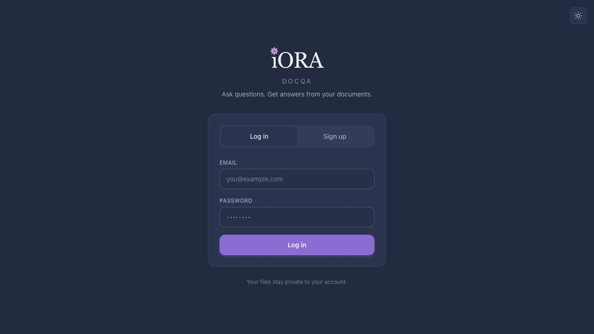
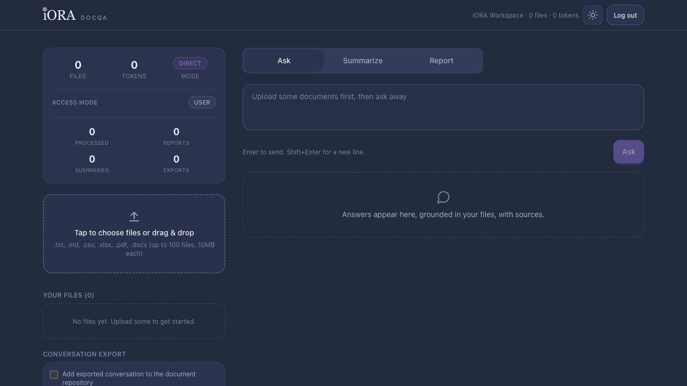

# iORA DocQA

Production document intelligence platform for iORA.

- **Public repository:** https://github.com/Ranbirkumar26/iora-docqa
- **Live deployment:** https://docqa-chi.vercel.app
- **Current live hosting:** Vercel, with FastAPI exposed through `/api` and the built Next.js app served at `/`
- **Backend services:** Supabase Auth, Postgres, pgvector, and Storage
- **Primary admin email:** `rk26.ftw@gmail.com`

DocQA lets verified users upload organisational documents, ask grounded questions, search across their private corpus, generate summaries and reports, and manage account security. It is built as a real product workspace rather than a prototype: authentication, approval-based signup, per-user data isolation, admin access control, durable generated outputs, document storage, and deployment configurations are all included.

## Product Screenshots

**Login and approval-based entry**



**Private document workspace**



**Admin access control**


## What The Product Does

DocQA turns a user's private document collection into an intelligent workspace.

1. A user requests access with an email address.
2. An admin approves the request from Access Control.
3. The user creates an account, confirms the email link, and logs in.
4. The user uploads files such as `.txt`, `.md`, `.csv`, `.xlsx`, `.pdf`, and `.docx`.
5. The backend extracts text and structured rows, stores originals in Supabase Storage, stores metadata and chunks in Supabase Postgres, and creates embeddings for retrieval.
6. The user can ask questions, run keyword search, generate summaries, create reports, export conversations, and save useful memory facts.
7. Answers are grounded in the user's own uploaded data. Admins can manage roles, but they do not automatically see another user's private documents.

The app supports both qualitative document analysis and structured spreadsheet-style questions. Quantitative questions use deterministic SQL execution where possible, so counts and aggregations are not left to the LLM.

## Feature Map

### Authentication And Signup

- Email/password login through Supabase Auth.
- Email confirmation before full account usage.
- Approval-based signup: new users submit a request first, and an admin must approve it before signup is allowed.
- Admin approval/rejection of signup requests from Access Control.
- Self-service password reset with email recovery links.
- Change-password flow that re-authenticates the current password.
- Password visibility toggle on auth password fields.
- Optional TOTP MFA enrollment, verification, login challenge, and admin MFA reset.
- Logout, logout-all, and account deletion.
- Rate limiting for login, signup, resend, reset, ask, and upload paths.

### Roles And Access Control

All accounts share one organisation workspace for role management, while user data remains scoped to the owner.

| Role | Data Scope | Permissions |
|---|---|---|
| `user` | Own documents, outputs, messages, profile, memory | Upload, ask, search, summarize, report, export, delete own data |
| `author` | Own documents, outputs, messages, profile, memory | Read-only access to own data |
| `admin` | Own data plus member management | Manage signup approvals, roles, suspension, reinstatement, MFA reset, and member removal |
| `Super Admin` | Bootstrap admin from `APP_ADMIN_EMAILS` | Permanent admin privileges; cannot be demoted, suspended, or removed by regular admins |

Admin-only API routes enforce the same restrictions that the frontend shows. Super Admin protections are enforced on both sides.

### Document Upload And Processing

- Supported file types: `.txt`, `.md`, `.csv`, `.xlsx`, `.pdf`, `.docx`.
- Private Supabase Storage bucket: `user-documents`.
- Hash-based duplicate detection.
- Parser layer for plain text, markdown, spreadsheets, PDFs, and Word documents.
- Chunking optimised by document type:
  - Text/markdown/PDF/DOCX: text chunks.
  - CSV: row-aware chunks.
  - XLSX: per-sheet and row-aware chunks.
- Gemini embeddings stored at a stable dimension of 768.
- Upload jobs are recorded synchronously today and can be moved to background workers later.
- Per-document transcript/extracted-detail artefacts are generated where applicable.
- Extracted spreadsheet-style details can be downloaded as `.xlsx`.

### Ask, Search, Summaries, And Reports

- Automatic answer routing:
  - Direct context for smaller corpora.
  - Hybrid RAG for larger corpora.
  - Structured SQL path for spreadsheet-style quantitative questions.
  - Decision-support path for recommendations and next actions.
  - Memory path for remembered user facts.
- Dedicated Search tab using Postgres full-text search.
- Hybrid retrieval fuses keyword search and vector retrieval.
- Search and answer results cite source filenames.
- Structured answers expose the SQL used to compute the result.
- Individual summaries are generated by default.
- Collective summaries/reports are generated only when explicitly requested.
- Reports are saved to private report history.
- Conversation history persists across navigation and refresh.
- Export conversations as Markdown or plain text.
- Optional export attachment back into the searchable repository.

### Memory And Profile

- Users can save personal facts with prompts such as `remember ...`.
- Memory facts are scoped to the signed-in user.
- Saved facts are injected into later questions.
- Users can delete memory entries from the sidebar.
- Profile fields can be saved and used as additional context for answers.

### AI Provider Layer

`LLM_CHAIN` controls the fallback order. Default:

```text
groq,gemini,qwen
```

Providers without keys are skipped. If a provider is rate-limited or unavailable, the next configured provider is tried.

| Provider | Default Model | Use |
|---|---|---|
| Groq | `llama-3.3-70b-versatile` | Fast general answering |
| Gemini | `gemini-2.5-flash-lite` | General answering and embeddings |
| Qwen | `qwen/qwen3-coder:free` through OpenRouter | Fallback and coding/SQL-style tasks |

Embeddings always use Gemini `gemini-embedding-001` to keep stored vectors consistent.

## Architecture

```text
Browser
  |
  | Next.js static frontend
  v
FastAPI app at /api
  |
  | Auth/session checks
  v
Supabase Auth
  |
  | Metadata, chunks, messages, roles, memory, outputs
  v
Supabase Postgres + pgvector + full-text search
  |
  | Original files
  v
Supabase Storage bucket: user-documents
  |
  | LLM calls and embeddings
  v
Gemini / Groq / Qwen
```

### Runtime Entrypoints

- `app/api/main.py` - main FastAPI app and `/api` routes.
- `api/index.py` - Vercel ASGI adapter.
- `web/app/page.tsx` - Next.js static frontend entry.
- `web/components/Dashboard.tsx` - authenticated workspace shell.
- `web/components/AuthView.tsx` - login, signup request, signup, and password flows.
- `web/components/ResetPasswordView.tsx` - reset-password route UI.
- `web/lib/api.ts` - browser API client and auth header handling.

### Important Backend Modules

| Path | Purpose |
|---|---|
| `app/config.py` | Environment variables, model defaults, thresholds |
| `app/db/client.py` | Supabase clients and auth helpers |
| `app/db/schema.sql` | Database schema, tables, indexes, storage policies, helper SQL |
| `app/parsers/parse.py` | File parsing |
| `app/rag/chunk.py` | Chunk creation |
| `app/rag/embed.py` | Embedding calls and vector helpers |
| `app/core/ingest.py` | Upload pipeline |
| `app/core/corpus.py` | Corpus stats and mode detection |
| `app/core/qa.py` | Main question-answer routing |
| `app/core/search.py` | Keyword search |
| `app/core/structured.py` | Spreadsheet SQL path |
| `app/core/summarize.py` | Individual and collective summaries |
| `app/core/report.py` | Report generation |
| `app/core/outputs.py` | Conversation history, reports, exports |
| `app/core/memory.py` | User memory |
| `app/core/profile.py` | Profile context |
| `app/core/signup_requests.py` | Approval-based signup workflow |
| `app/core/audit.py` | Audit logging |
| `app/core/account.py` | Account deletion and cleanup |
| `app/core/mfa.py` | TOTP flows |
| `app/core/orgs.py` | Organisation and role helpers |

## API Surface

The app exposes a broader route set in `app/api/main.py`. High-level groups:

- Health: `GET /api/health`
- Auth: login, signup request, signup approval, resend confirmation, password reset, change password, MFA, logout-all
- Documents: upload, list files, delete files, extracted artefact download
- Ask/Search: ask questions, keyword search, structured SQL answer path
- Summaries/Reports: generate summaries, generate reports, list/download report history
- Conversation/Exports: message history and export endpoints
- Memory/Profile: remember, recall, delete memory, load/save profile
- Admin: members, role updates, signup requests, audit log, suspend/reinstate/remove/reset MFA

When adding routes, follow the existing pattern: validate the Supabase user, derive the user id from the token, enforce role checks server-side, and avoid trusting user-supplied owner ids.

## Data And Storage Model

Supabase is the source of truth.

- Supabase Auth owns users, sessions, password reset, email confirmation, and MFA.
- Supabase Storage stores original uploaded files in `user-documents`.
- Supabase Postgres stores:
  - file metadata
  - parsed chunks
  - embeddings
  - messages
  - generated outputs
  - report history
  - memory facts
  - profile data
  - organisation membership and roles
  - signup requests
  - audit events

Most reads and writes are done through backend code with the Supabase service key. User isolation is enforced in application logic, and the schema includes RLS support for selected read paths.

## Environment Variables

Create `.env` from `.env.template`.

Required for a functional deployment:

```bash
SUPABASE_URL=
SUPABASE_ANON_KEY=
SUPABASE_SERVICE_KEY=
GEMINI_API_KEY=
APP_BASE_URL=https://docqa-chi.vercel.app
APP_ADMIN_EMAILS=rk26.ftw@gmail.com
DEFAULT_ORGANIZATION_NAME=iORA Workspace
```

Recommended or optional:

```bash
GROQ_API_KEY=
QWEN_API_KEY=
QWEN_BASE_URL=https://openrouter.ai/api/v1
QWEN_MODEL=qwen/qwen3-coder:free
GROQ_MODEL=llama-3.3-70b-versatile
GEMINI_MODEL=gemini-2.5-flash-lite
LLM_CHAIN=groq,gemini,qwen
APP_ALLOWED_EMAIL_DOMAINS=
CSP_ENFORCE=false
RLS_SCOPED_READS=false
```

Never commit `.env`, service-role keys, API keys, or Supabase secrets.

## Supabase Setup

1. Create or select the dedicated DocQA Supabase project.
2. Apply `app/db/schema.sql` in Supabase SQL Editor.
3. Create a private storage bucket named `user-documents`.
4. Enable Email/Password Auth.
5. Enable Confirm Email.
6. Enable TOTP under Auth Multi-Factor if MFA is required.
7. Add the live URL to Auth redirect URLs:

```text
https://docqa-chi.vercel.app
https://docqa-chi.vercel.app/auth/callback
https://docqa-chi.vercel.app/auth/reset
```

8. Configure SMTP for production-quality confirmation and reset emails.

Do not point this project at any `iamai_CMS` Supabase project, database, service key, or storage bucket.

## Local Development

```bash
cd /Users/tarry/Desktop/docqa
cp .env.template .env

python -m venv .venv
source .venv/bin/activate
pip install -r requirements.txt

cd web
npm install
npm run build
cd ..

uvicorn app.api.main:app --host 127.0.0.1 --port 8000 --reload
```

Open:

```text
http://127.0.0.1:8000
```

Frontend hot reload:

```bash
cd /Users/tarry/Desktop/docqa/web
npm run dev
```

The legacy Streamlit UI remains at `frontend/app.py` for local experiments only.

## Tests

Run backend tests:

```bash
cd /Users/tarry/Desktop/docqa
source .venv/bin/activate
pytest -q
```

Run frontend build:

```bash
cd /Users/tarry/Desktop/docqa/web
npm run build
```

Recommended smoke after any change:

1. Health endpoint returns ok.
2. Signup request requires admin approval.
3. Approved email can sign up and confirm.
4. Login/logout works.
5. User upload is private to that user.
6. Ask works for text documents.
7. Structured question works for CSV/XLSX.
8. Search returns matching documents.
9. Summary/report generation works.
10. Admin can change a disposable user's role.
11. Admin cannot demote, suspend, or remove the Super Admin.
12. Author cannot upload, delete, or generate saved outputs.

## Deployment

### Vercel

The current live deployment is on Vercel.

Important files:

- `vercel.json`
- `api/index.py`
- `requirements-vercel.txt`
- `scripts/vercel-build.sh`
- `.vercelignore`

Deploy from repo root:

```bash
vercel --prod
```

Set all production environment variables in Vercel. `APP_BASE_URL` must point to the Vercel production URL, and that URL must also be allowed in Supabase Auth redirect settings.

### Docker / Railway / Render / Replit

The project also includes deployment support for:

- Docker through `Dockerfile`
- Railway through the same Docker container
- Render through `render.yaml`
- Replit through `.replit`, `replit.nix`, `scripts/replit-build.sh`, and `scripts/replit-start.sh`

For Docker-style hosts, the container builds the Next.js static export, installs Python dependencies, and starts FastAPI on `$PORT`.

## Known Vulnerabilities And Risk Register

This section is intentionally direct so future engineers and LLM agents can understand where to be careful.

| Risk | Severity | Current Mitigation | What To Recheck Before Production Changes |
|---|---:|---|---|
| Secrets exposure | Critical | `.env` and local secret files are ignored | Confirm no API keys, Supabase service keys, or Netlify/Vercel tokens are committed |
| Cross-user data leakage | Critical | Backend derives user id from Supabase token and scopes queries | Re-run IDOR tests after changing file, output, memory, report, or admin routes |
| Admin privilege bypass | Critical | Role checks are enforced server-side; Super Admin is protected | Re-test Access Control after any auth, member, or role change |
| Supabase project collision | Critical | README and env setup require a dedicated DocQA Supabase project | Never reuse `iamai_CMS` Supabase URL, service key, database, or storage bucket |
| RLS drift | High | Application-level scoping is primary; `RLS_SCOPED_READS` defaults off | Audit `app/db/schema.sql` before enabling RLS-scoped user reads in production |
| Vercel serverless limits | High | Vercel bundle is slimmed through `requirements-vercel.txt` | Large PDFs/DOCX, long report jobs, or many embeddings can hit time or memory limits |
| LLM hallucination | High | Structured path executes SQL for numeric answers; answers cite files | Treat qualitative text as model-generated; add evaluation data for business-critical use |
| SQL generation mistakes | High | SQL path validates read-only queries and uses DuckDB with external access disabled | Keep tests around blocked operations, multi-statement SQL, and unsupported functions |
| Email confirmation/reset misconfiguration | High | `APP_BASE_URL` and Supabase redirects are documented | Verify live confirmation, resend, and reset links after every domain migration |
| Signup request schema missing | Medium | Code has fallbacks for some missing schema pieces | Always apply latest `app/db/schema.sql` after pulling changes |
| CSP is report-only by default | Medium | Security headers are present; CSP can be enforced with `CSP_ENFORCE=true` | Test all frontend assets before enforcing CSP |
| Rate-limit bypass through distributed IPs | Medium | Basic API rate limits exist | Add provider-level/WAF limits if public traffic grows |
| File parsing edge cases | Medium | Parsers and tests cover common formats | Re-test malformed PDFs, large XLSX sheets, password-protected files, and empty content |
| Dependency vulnerabilities | Medium | Lockfiles are committed for frontend | Run `npm audit`, `pip-audit`, or equivalent before formal release |
| Optional provider dependency mismatch | Medium | Vercel requirements intentionally exclude unused heavy packages | If enabling Claude/Voyage or new providers, update deployment requirements and bundle checks |
| Audit log completeness | Low | Admin actions are recorded | Confirm every newly added destructive/admin action writes an audit event |

## Agent Handoff Guide

If another LLM agent continues this project, start here:

1. Read this README fully.
2. Run `git status --short` in `/Users/tarry/Desktop/docqa`.
3. Do not modify `/Users/tarry/Desktop/docqa/IORA_MVP_v1` from the main repo unless the task explicitly targets the MVP. It is a nested repo and appears untracked from the main repo.
4. Read `app/api/main.py` before changing API behaviour.
5. Read `web/lib/api.ts` and the affected frontend component before changing UI flows.
6. Read `app/db/schema.sql` before adding any database field or storage behaviour.
7. Keep user isolation as the first invariant: never accept a client-supplied owner id for private data.
8. Keep Super Admin protection as the second invariant: `APP_ADMIN_EMAILS` accounts cannot be demoted, suspended, removed, or edited by regular admins.
9. Keep generated SQL read-only.
10. Re-run the smallest relevant backend tests and a frontend build before pushing.

Safe documentation-only commit pattern:

```bash
git status --short
git add README.md docs/
git commit -m "docs: expand project handoff"
git push origin HEAD:master
```

Safe code-change verification pattern:

```bash
pytest -q
cd web && npm run build
```

## Repository Layout

```text
app/
  api/main.py          FastAPI routes and static app serving
  config.py            settings, providers, thresholds
  db/                  Supabase clients and schema
  parsers/             document parsers
  rag/                 chunking and embeddings
  llm/                 Gemini, Groq, Qwen, OpenAI-compatible provider layer
  core/                product workflows
api/index.py           Vercel ASGI adapter
docs/                  README screenshots
frontend/app.py        legacy Streamlit UI
scripts/               deployment build/start scripts
tests/                 backend regression tests
web/                   Next.js frontend
Dockerfile             Docker/Railway container build
render.yaml            Render deployment blueprint
vercel.json            Vercel deployment config
```

## Maintenance Checklist

Before a public handover or production push:

- README live URL is correct.
- Screenshots still match the current product.
- `.env.template` matches required runtime variables.
- Supabase schema has been applied to the correct project.
- Supabase redirect URLs include the deployed domain.
- `APP_ADMIN_EMAILS` includes the intended Super Admin.
- Test suite passes.
- Frontend builds.
- Live `/api/health` returns ok.
- A disposable user can complete the approved signup flow.
- A regular user cannot see Access Control.
- Super Admin protections are still enforced.
- No temporary QA accounts, files, or secrets remain.
