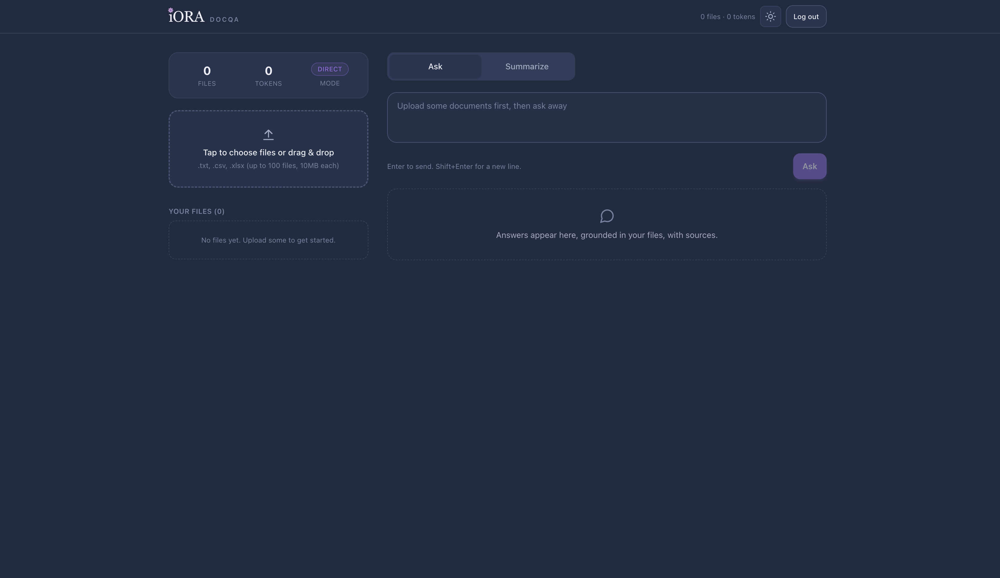
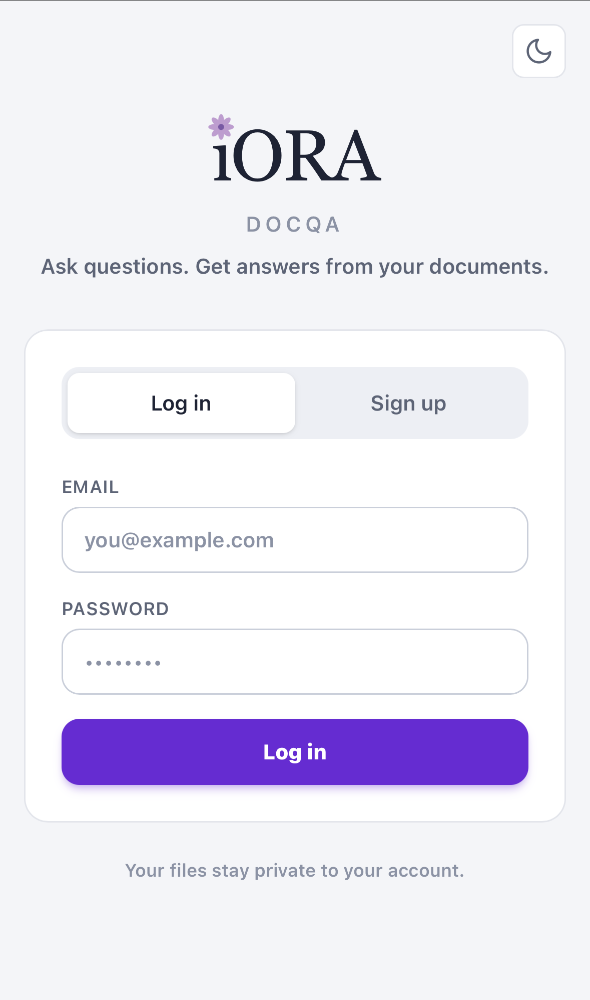

# iORA DocQA

**Repository copy:** https://github.com/Ranbirkumar26/iora-docqa-copy
**Live deployment:** https://iora-docqa-copy-production.up.railway.app

Upload txt/md/csv/xlsx/pdf/docx files, ask questions and get summaries grounded in your documents.
Files persist per user and accumulate into one queryable corpus across sessions.
Responsive web app: works on desktop and mobile browsers, light/dark theme.
All users join one shared organisation workspace. New accounts start as `user`;
only configured admin email(s) can manage role upgrades.

## Current Additions

- Organisation-scoped corpus data via one shared workspace.
- Saved report history as an organisation knowledge repository.
- Durable conversation history and generated outputs, so Ask/Summary/Report
  content survives navigation and refreshes after the schema is applied.
- Conversation export to Markdown or plain text, with an option to attach the
  export back into the searchable document repository.
- Per-document transcript and extracted-details artifacts on upload; extracted
  details can be downloaded as `.xlsx` files.
- Processing job records for upload/report workflows; these are synchronous today
  and ready to be moved to background workers later.
- PDF and DOCX extraction alongside txt/md/csv/xlsx.
- Role-based access modes:
  - `user`: can upload, ask, summarize, report, export, and delete only their own data.
  - `author`: organisation-wide read-only access for collective viewing and Ask analysis.
  - `admin`: organisation-wide read/write/delete access, plus role management.

## Screenshots

**Main (dark, brand navy)**



**Login (light)**



## How it answers

Query paths, picked automatically per question:

- **Direct** (corpus < ~150k tokens): all text stuffed into the model context. Max accuracy.
- **RAG** (larger corpus): chunk -> embed (Gemini) -> pgvector search -> answer from top passages.
- **Structured** (quantitative questions over csv/xlsx): the model writes SQL, DuckDB executes
  it on the real table, the model phrases the exact result. No LLM arithmetic.
- **Decision support** (recommendations / next actions): computed table signals plus document
  evidence are turned into grounded recommendations, risks, caveats, and next actions.
- **Summaries/Reports**: individual document outputs are generated by default.
  Collective summaries/reports are generated only when explicitly requested.
  Generated reports are saved to the organisation's report history.
- **Memory**: facts you ask it to remember are answered from saved memory (see below).

Answers cite source filenames; the structured path also exposes the SQL it ran.

## Memory

Type `remember ...` (also `note that ...`, `don't forget ...`, `my name is ...`) and the
fact is saved to your account. Saved facts are injected into later questions, so
"what is my name?" is answered from memory (works even with no documents). Manage them in
the sidebar Memory list (delete any). Stored in a Supabase `memories` table (RLS-isolated,
capped at 30 facts). Capture is heuristic today, swappable to an LLM intent check later.

## Access Modes

Every account belongs to the shared organisation. The backend enforces access
with an `organization_members.role` value:

| Role | Scope | Permissions |
|---|---|---|
| `user` | Own uploaded files, messages, outputs, memory | Read/write/delete own data |
| `author` | All organisation files, messages, outputs, reports | Read-only; cannot upload, delete, overwrite, generate saved outputs, or change memory |
| `admin` | All organisation data | Full read/write/delete; can update member roles |

Admins can manage roles from the dashboard Access Control panel. The API also exposes
`GET /api/members` and `PATCH /api/members/{user_id}` for role management.
Only emails listed in `APP_ADMIN_EMAILS` become admin automatically. Everyone
else is created as `user`, then can be promoted by an admin.

## LLM fallback chain

`LLM_CHAIN` is an ordered, comma-separated list (default `groq,gemini,qwen`). The first is
the everyday primary; each next is tried when the previous is rate-limited. Providers
without a key are skipped, so it works incrementally. If all are exhausted the API returns
a clean 429. All three are free tiers:

| Provider | Model | Endpoint |
|---|---|---|
| Groq | `llama-3.3-70b-versatile` | Groq Cloud |
| Gemini | `gemini-2.5-flash-lite` | Google AI Studio |
| Qwen | `qwen/qwen3-coder:free` | OpenRouter |

Embeddings are always Gemini (`gemini-embedding-001`, 768d) so stored vectors stay consistent.
Reorder anytime with the `LLM_CHAIN` env var, no code change.

## Stack

| Layer | Tech |
|---|---|
| Frontend | Next.js 15 + React 19 + Tailwind v4, static export, light/dark theme |
| Backend | FastAPI (serves the SPA at `/` and the API under `/api`) |
| Auth, storage, DB | Supabase (Postgres + pgvector + Storage + Auth, RLS) |
| LLM | Fallback chain: Groq -> Gemini -> Qwen (all free tiers) |
| Embeddings | Gemini `gemini-embedding-001` (768d) |
| Tabular queries | DuckDB (SELECT-only, external access disabled) |
| Document parsing | pandas/openpyxl, pypdf, python-docx |
| Hosting | Railway, single Docker container |

## Setup

1. Copy `.env.template` to `.env` and fill `SUPABASE_URL`, `SUPABASE_ANON_KEY`,
   `SUPABASE_SERVICE_KEY`, plus at least one LLM key (`GROQ_API_KEY`, `GEMINI_API_KEY`,
   `QWEN_API_KEY`). Gemini is required for embeddings. Missing LLM keys are skipped in the chain.
   Set `APP_ADMIN_EMAILS` to the comma-separated list of bootstrap admin emails.
2. Apply `app/db/schema.sql` in the Supabase SQL editor; create a private storage
   bucket named `user-documents`. Re-run the schema after updates; it includes
   idempotent `alter table ... add column if not exists` and backfill SQL for
   the shared organisation workspace, generated outputs, and role normalization.
3. Backend deps: `python -m venv .venv && .venv/bin/pip install -r requirements.txt`
4. Frontend deps: `cd web && npm install`

## Run locally

```bash
# build the SPA once (FastAPI serves web/out)
cd web && npm run build && cd ..

# serve app + API on :8000
.venv/bin/uvicorn app.api.main:app --reload
# open http://localhost:8000
```

Frontend development with hot reload (proxies /api to :8000):

```bash
cd web && npm run dev   # http://localhost:3000
```

A legacy Streamlit UI remains in `frontend/app.py` for quick local poking:
`.venv/bin/streamlit run frontend/app.py`.

## Tests

```bash
.venv/bin/python -m pytest tests/ -q
```

## Deploy

Single container: Streamlit-free, FastAPI serves SPA + API on `$PORT`.

- **Railway** (current): `railway up` from the repo root (project already linked).
  Set the secrets as service variables (Supabase + LLM keys).
- **Render**: push to GitHub, New -> Blueprint (reads `render.yaml`), set the secrets.
- **Local Docker**:
  ```bash
  docker build -t docqa .
  docker run --env-file .env -p 8600:8000 docqa   # http://localhost:8600
  ```

## Layout

```
app/
  config.py          settings, provider switches, thresholds
  parsers/parse.py   txt/md/csv/xlsx/pdf/docx -> text
  rag/chunk.py       structure-aware chunking (rows for csv, per-sheet for xlsx)
  rag/embed.py       Gemini/Voyage embeddings (cached query embeds)
  llm/               provider.py (fallback chain), gemini.py, groq.py, qwen.py,
                     openai_compat.py (shared client), claude.py, errors.py
  core/
    ingest.py        upload pipeline: parse -> store -> hash dedup -> chunk -> embed
    corpus.py        corpus stats + mode detection + full-text fetch
    qa.py            ask(): memory / direct / rag / structured routing
    outputs.py       conversation history, generated artifacts, exports, xlsx extraction
    decision.py      grounded recommendations, risks, caveats, next actions
    structured.py    DuckDB SQL path for quantitative questions
    report.py        deterministic stats + qualitative synthesis -> report
    jobs.py          sync job records now, ready for async workers later
    orgs.py          shared organisation workspace helpers
    summarize.py     individual summaries + explicit collective summaries
    memory.py        per-user remember/recall (capture, store, inject)
  db/                supabase clients, schema.sql
  api/main.py        FastAPI: /api routes + static SPA mount
web/                 Next.js app (components, theme tokens, iORA branding)
frontend/app.py      legacy Streamlit UI (local dev only)
tests/               parser, chunking, structured-SQL, fallback, memory tests
```

## Notes

- Same filename re-uploaded with new content replaces the old version; identical
  content is skipped (sha256 dedup).
- Upload/report job records are created synchronously today; the schema is shaped
  so a queue/worker can update the same records later.
- Free LLM tiers are rate-limited (Groq/Gemini/Qwen); the chain falls through on 429
  and only returns 429 to the client when every configured provider is exhausted.
- Railway free tier sleeps when idle; first request after a pause cold-starts.
